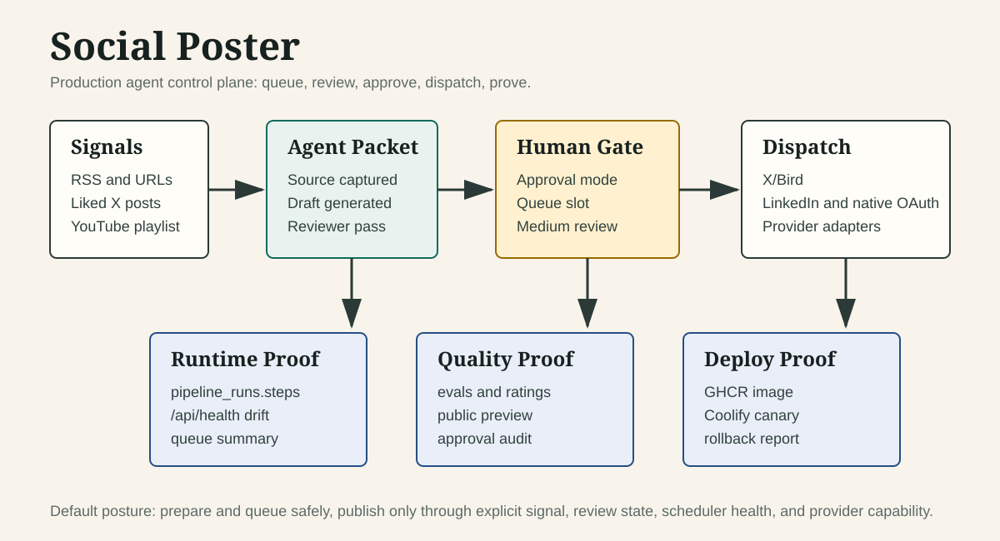

# Social Poster

Production social and Medium agent system for Max Petrusenko. Dashboard first, agent second.



Social Poster is a Next.js 15 control plane for scheduled posts, X liked-post queueing, reply review, Medium article packages, provider connections, and deployment health. The important product shape is not "an agent posts anything it wants." The system keeps publishing behind explicit signals, review gates, scheduler health checks, and durable run evidence.

## What It Proves

- Queueing: liked X posts become scheduled `posts` rows, assigned hourly slots between 8 AM and 8 PM, deduped by `x-like:<tweetId>`, then published later by the normal scheduler.
- Approval gates: workspace approval modes, post approval requests, review queues, and Medium review-first flow are first-class surfaces.
- Evals and report artifacts: chatbot replay reports, article rating/eval files, pipeline step trails, deploy reports, and LangSmith trace links are preserved where configured.
- Provider integrations: X/Bird, LinkedIn, Instagram, Facebook, Threads, TikTok, Bluesky, Mastodon, YouTube, Pinterest, and Google Business are registered in the platform layer, with OAuth/env setup documented.
- Deployment: GitHub Actions builds GHCR images, deploys to Coolify on Contabo, checks `/health` and `/api/health`, captures SQLite backups, and rolls back on failed public canary.
- Safety controls: default-disabled background liked-post worker, explicit publish mode env, dedupe, content reviewer, source verification, token refresh, Bird session health checks, audit events, and fail-closed writer/reviewer behavior.
- Local/dev proof: documented local runs use `DISABLE_AUTH=true`, isolated SQLite files, `/api/health`, article queue sync/export/verify scripts, and Manatee chatbot evals.

## Demo Script

See [docs/demo.md](docs/demo.md) for a click-by-click GitHub demo path.

Fast path:

1. Open `/dashboard/articles` and show the YouTube-to-Medium queue.
2. Open an article package and show `overview.md`, `workflow.json`, `evals/`, images, and rating state.
3. Open `/dashboard/likes` and show eligible/skipped liked X candidates.
4. Open `/dashboard/pipeline` and show `x-like:*` steps for source capture, draft, reviewer, packet readiness, queue slot, and learning state.
5. Open `/dashboard/schedules` and `/api/health` to show DB/runtime schedule drift.
6. Open the Actions deploy report artifact from `Fast Coolify Deploy`.

## Architecture

```text
source signals
  RSS, manual composer, liked X posts, YouTube playlist, article workspace
        |
        v
agent and queue layer
  source capture -> model draft -> reviewer/eval -> packet readiness -> scheduled slot
        |
        v
operator control plane
  dashboard, approval request API, queues, pipeline steps, logs, health
        |
        v
provider dispatch
  X/Bird, LinkedIn, Instagram, Facebook, Threads, TikTok, Bluesky, Mastodon,
  YouTube, Pinterest, Google Business, Late/Zernio where configured
        |
        v
production proof
  posts, post_targets, pipeline_runs, /api/health, deploy report, public canary
```

## Human Gates

Social Poster supports several lanes with different proof requirements:

| Lane | Publish signal | Gate |
| --- | --- | --- |
| Manual post | Operator clicks publish or schedules a post | Composer validation plus platform target checks |
| Workspace approval | Operator requests approval | `POST /api/posts/[id]/approval-request` records request, decision, audit event |
| X liked-post queue | Max likes a post and worker is explicitly enabled | Source checks, dedupe, AI draft, independent reviewer, queued slot, fail closed on repeated failure |
| Medium article | YouTube playlist or explicit source | Article package, eval loop, public preview, Matrix review, then visible Medium UI mutation only after Max approval |
| Replies | Review/ready queue | Candidate discovery, draft review, ready state before dispatch |

The repo contains a marketing landing page that mentions autonomous behavior, but this README intentionally describes the verified control-plane behavior. Medium generation is review-first. Background liked-post import is off unless `X_LIKES_AUTOPUBLISH_ENABLED=true` and `X_LIKES_AUTOPUBLISH_MODE=publish`.

## Evidence Map

| Claim | Evidence |
| --- | --- |
| Production app and stack | `AGENTS.md`, `CLAUDE.md`, `package.json` |
| Scheduler health drift | `src/app/api/health/route.ts` returns `dbEnabledCount`, `runtimeRegisteredCount`, `drift`, and liked-post queue summary |
| Post approval API | `src/app/api/posts/[id]/approval-request/route.ts` |
| X liked-post queue | `src/lib/x-liked-autopost.ts`, `src/lib/x-liked-autopost-queue.ts`, `src/app/dashboard/likes/page.tsx` |
| Medium review-first workflow | `docs/hermes/weekly-youtube-medium-article.md` |
| Article package/evals | `data/article-workspace/articles/*/overview.md`, `evals/`, `workflow.json` |
| Chatbot eval reports | `docs/chatbot-evals.md`, `manatee.config.mjs`, `manatee-eval.json` |
| Provider registry | `src/platforms/config-registry.ts`, `src/platforms/registry.ts`, `docs/plans/provider-architecture.md` |
| Deploy proof | `.github/workflows/fast-coolify-deploy.yml`, `scripts/ci/coolify-image-deploy.sh`, `npm run test:deploy-workflow` |
| Runtime config | `.env.example` |

## Local Proof

Use an isolated local DB when you want a demo without touching production state:

```bash
DISABLE_AUTH=true \
DATABASE_URL=/tmp/social-poster-demo.sqlite \
npm run dev -- -p 3010
```

Health proof:

```bash
curl -s http://localhost:3010/api/health
```

Article queue proof:

```bash
npm run articles:sync-youtube-queue
npm run articles:export-public-preview
npm run articles:verify-public-preview
```

Chatbot eval proof:

```bash
npm run manatee:test
```

Deploy workflow regression:

```bash
npm run test:deploy-workflow
```

## Deployment

Production is `https://social.maxpetrusenko.com`.

The deploy workflow:

1. Runs unit tests, deploy workflow regression, typecheck, lint, E2E CI tests, and browser tests.
2. Builds and pushes `ghcr.io/maxpetrusenko/social-poster:sha-<commit>`.
3. Deploys to Coolify over a private SSH path.
4. Captures the previous image tag and a pre-deploy SQLite backup.
5. Verifies public `/health` and `/api/health`.
6. Rolls back to the previous image if the public canary fails.
7. Uploads a 30-day deploy report artifact.

## Current Boundaries

- Do not enable additional public schedules without explicit operator approval.
- Do not claim Medium autopublish. Medium mutation and scheduling require Max approval plus visible UI proof.
- Comments and DMs have intentionally stricter safeguards and some surfaces are paused until the permission model and audit trail are complete.
- SQLite is still the active runtime database. Supabase Postgres migration is planned, not complete.
- Cross-workspace aggregate reporting and some provider depth work remain open.

