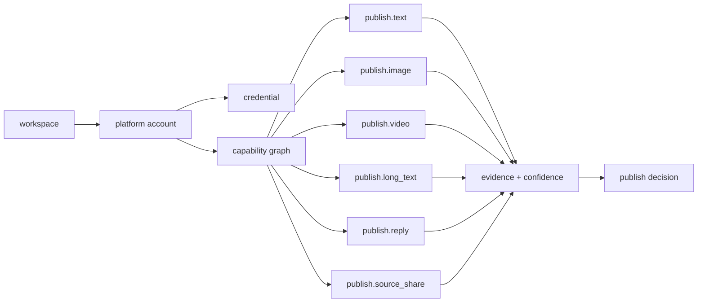
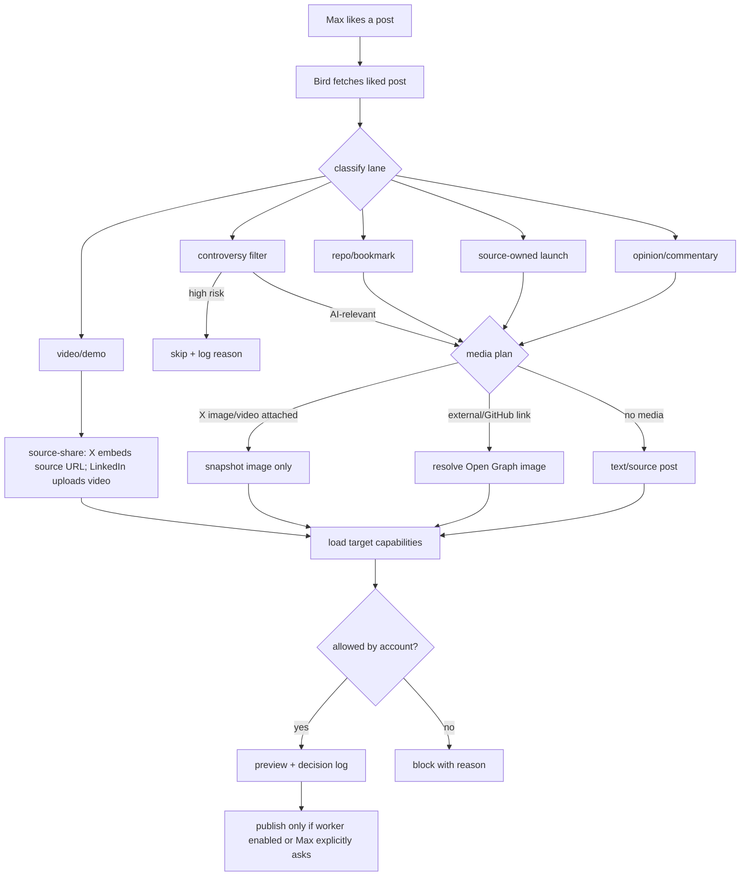

---
read_when:
  - changing platform capability checks
  - debugging why a post published as text, image, video, thread, or source share
  - adding a new social account provider
---

# Capability Decision Flow

Last updated: 2026-05-23

Visual HTML version: `docs/plans/capability-decision-flow.html`

## Capability Graph

## Liked X Post Decision

## Capability Keys

Current V0 keys:
- `publish.text`
- `publish.image`
- `publish.video`
- `publish.reply`
- `publish.schedule`
- `publish.thread`
- `publish.long_text`
- `publish.link_preview_image`
- `publish.source_share`

Each key has:
- `status`: `supported`, `unsupported`, `unknown`, or `degraded`
- `confidence`: `observed`, `verified`, `operator_confirmed`, `config`, or `provider_default`
- `evidence`: raw check output, publish outcome, operator note, or provider default

## Max X Account

Known rules:
- `publish.long_text` is a Max account capability, not a global X assumption.
- liked-post X publishing uses single long posts when possible.
- video/demo likes should source-share on X so the original post embeds, then reply with source attribution. LinkedIn should upload the copied video file natively and put source attribution in the first comment because LinkedIn does not embed the X video from the source URL.
- source-owned launches stay attributed to the source account.
